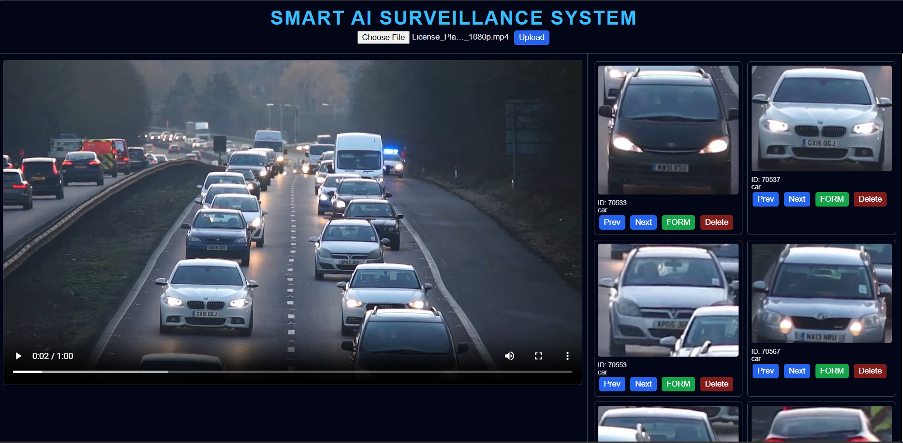
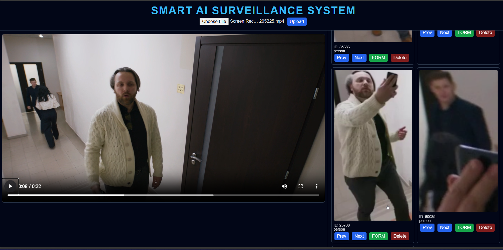
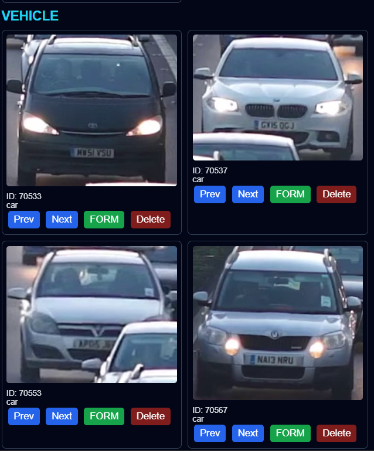
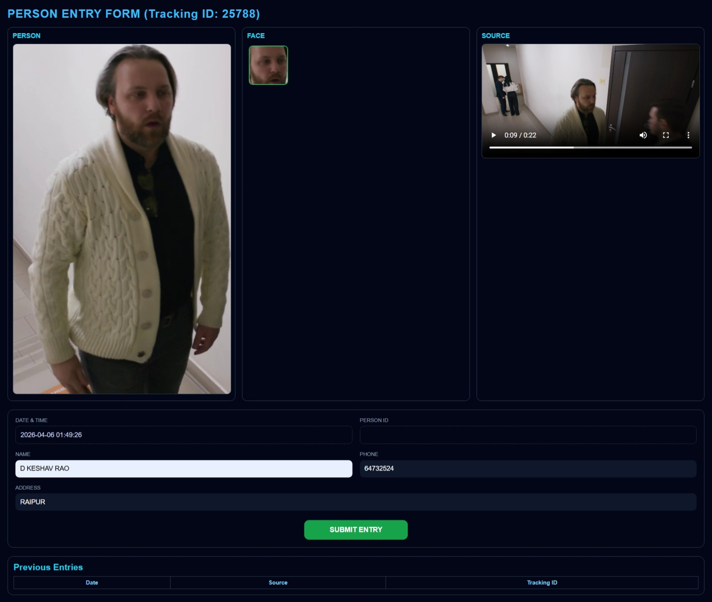
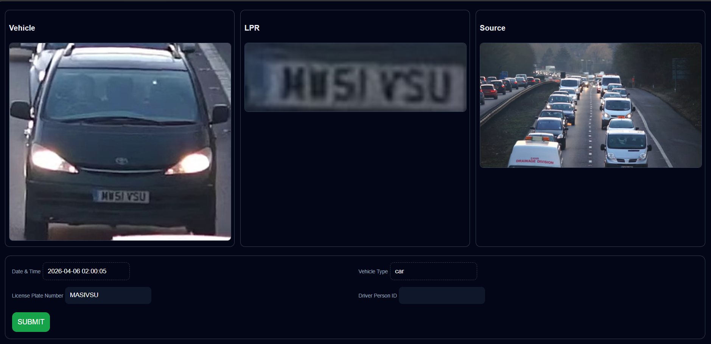

# 🚀 Smart AI Surveillance System

An AI-powered surveillance system for real-time **person detection, face recognition, vehicle detection, and license plate recognition (LPR)**.


## 🔥 Features

* 👤 Person Detection + Face Recognition
* 🚗 Vehicle Detection + Number Plate Recognition (OCR)
* 🎥 Video & Image Processing
* 📊 Real-time Alerts Dashboard
* 🧠 AI Models (YOLO, InsightFace, TrOCR)
* 🖥️ Clean Web UI (Flask)


## 🛠️ Tech Stack

* Python
* Flask
* OpenCV
* YOLO (Ultralytics)
* InsightFace
* Transformers (TrOCR)
* PyTorch


## 📂 Project Structure

Smart AI Surveillance System/
│
├── app.py
├── requirements.txt
│
├── modules/
│ ├── main.py
│ ├── person.py
│ ├── vehicle.py
│ ├── logger.py
│ 
│
├── templates/
│ ├── index.html
│ ├── person.html
│ ├── vehicle.html
│
├── models/
│ └── (Add your trained model here e.g. best.pt or YOLO model)
│
├── outputs/
│   ├── face_embeddings.pkl        # User face embeddings for recognition
│   ├── person_data.csv           # Personal data of detected persons
│   ├── guard_entry.csv           # Entry data of detected persons (guard system)
│   ├── vehicle_data.csv          # Vehicle entry data
│   ├── logs.csv                 # All detections from main camera
│   ├── classes.txt              # List of model classes/categories
│
├── uploads/ (auto-created at runtime)
├── assets/ (screenshots for README)


## ⚙️ Installation

Create Environment (Recommended)
conda create -n surveillance python=3.10.0
conda activate surveillance

git clone https://github.com/dunatechnos/Smart_AI_Surveillance_System.git
cd Smart_AI_Surveillance_System

pip install -r requirements.txt
python app.py


## 📥 Model Download

⚠️⚠️ Model files are not included due to size limits.

You can use any YOLO model for this project.  
In this project, **YOLOv11** was used.  

- The model file should be named: `best.pt`  
- You can download or train your own YOLO model and place it in the project directory.

## Download here:
👉 [Download best.pt](https://github.com/ultralytics/assets/releases/download/v8.4.0/yolo11x.pt)

Place inside:
models/best.pt

## 🚀 Usage

Open browser:

```
http://127.0.0.1:5000
```

2## 🚀 Usage Guide (Step-by-Step)

---

## 📤 1. Upload Image / Video



- Users can upload **images or videos** using the upload section
- The system automatically detects:
  - 👤 Persons → shown in Person panel
  - 🚗 Vehicles (Car, Bike, Truck) → shown in Vehicle panel

---

## 🚨 2. Alerts & Detection Panels



- After processing, alerts are generated based on detected objects
- Each alert contains a **cropped patch**
- Alerts are updated in real-time

---

## 🎮 3. Alert Controls (Buttons Explained)



Each alert has 4 control buttons:

### ▶️ Next
- Moves to the next frame
- Helps find the best frame where face or number plate is clearly visible

### ◀️ Previous
- Moves to the previous frame
- Useful when current frame is unclear or blurred

### 🗑️ Delete
- Removes false or unwanted alerts

### 📝 Form
- Opens detailed form for data entry (Person / Vehicle)

---

# 👤 Person Form (Detailed View)



### 🔹 Top Section (3 Parts)

1. **Alert Crop**
   - Main detected person image

2. **Face Detection Panel**
   - Shows all detected faces in the crop
   - If multiple faces → all are displayed
   - If single face → only one is shown

3. **Source Video**
   - Original video frame

---

### 🧾 Form Section

- If the person is already known:
  - ✅ Face Recognition auto-fills the data

- If new person:
  - ❌ Manual entry is required

---

### 📜 History Section

- Displays previous entries of the person
- Shows entry timestamps and records

---

### ✅ Submit (Guard Entry)

- Saves new data into the system

---

# 🚗 Vehicle Form (Detailed View)



### 🔹 Top Section (3 Parts)

1. **Vehicle Crop**
2. **LPR Crop (Number Plate)**
3. **Source Video**

---

### 🔢 OCR Detection

- Number plate is automatically detected using OCR
- ⚠️ OCR may not be 100% accurate

👉 User can manually edit the number

---

### 🧾 Form Section

- Enter vehicle details:
  - Vehicle Number
  - Vehicle Type
  - Entry Information

---

### ✅ Submit

- Saves vehicle data into the system

---

## 🎯 Future Improvements

* Multi-camera dashboard
* Real-time notifications
* Cloud deployment
* Mobile support
* 📡 RTSP Live Stream Support

---

## 👨‍💻 Author

**Duna Keshav Rao**


